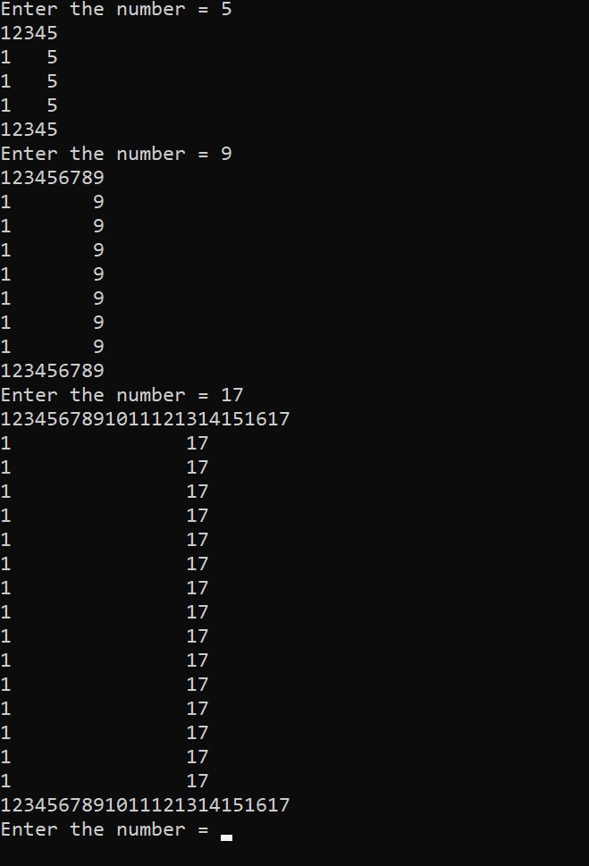
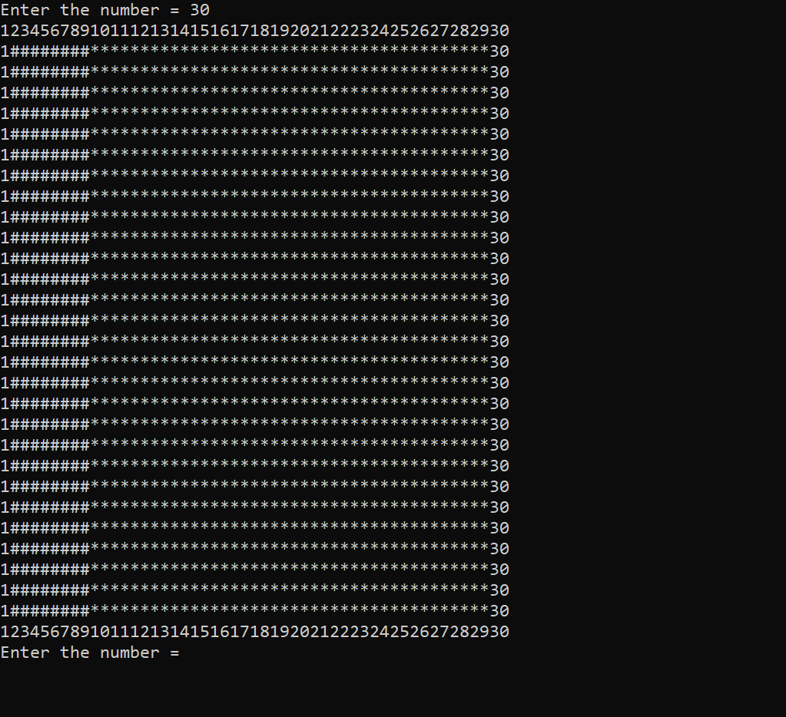

<!--comment-->
r _e_~~c~~t `angle`
---

<p>// write a programme that print rectangle</p>

```c
#include<stdio.h>
int main()
{
    int num,col,row;
    printf("Enter the number = ");
    scanf("%d",&num);

    for(row=1; row<=num; row++)
    {
        for(col=1; col<=num; col++)
        {
            if(row==1 || row==num || col==1 || col==num)
            printf("%d",col);
        else
        printf("*");
        }
        printf("\n");
    }
}
```

<image src="./images/prac.png" width="400" title="onedigit"/>

### with space

`printf("*");`



<p> // rectangle after 9 too </p> 

### Perfect rectangle

```c
#include<stdio.h>
int main()
{
    while(1)
    {
        int num,col,row;
        printf("Enter the number = ");
        scanf("%d",&num);

        for(row=1; row<=num; row++)
        {
            for(col=1; col<=num; col++)
            {
                if(row==1 || row==num || col==1 || col==num)
                printf("%d",col);
                else
                    if(col<=9)
                    printf("#");

                else
                    printf("**");
            }
            printf("\n");
        }
    }
}
```


### with space
`if(col<=9)`</br>
`printf("#");`</br>
`else`  
`printf("**");`  

<image src="./images/perfectspace.png" width="500" title="perfect space"/>

_continue_